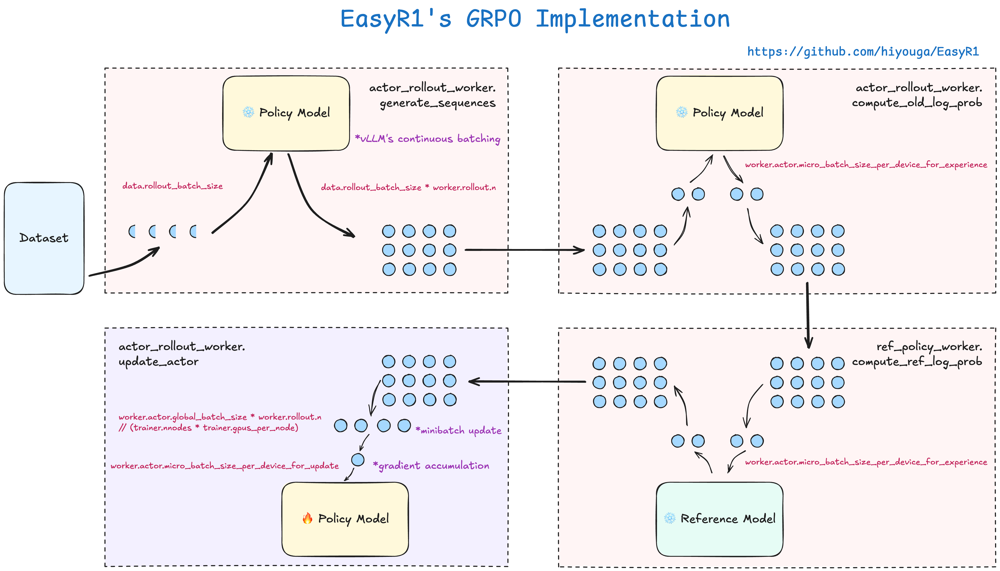
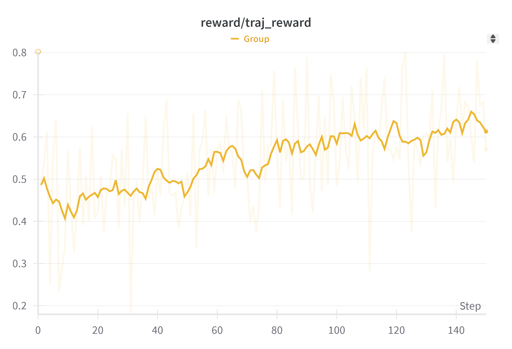

# WM-R1: Training GUI Agents to Reason with World Models via Reinforcement Learning

<div align="center">

[中文文档](README_CN.md)

</div>

---

## Overview

WM-R1 is a reinforcement learning framework that trains GUI agents to reason with **World Models (WM)** — using a VLM-based simulator to replace expensive real-environment interaction during RL training.

Traditional GUI agent RL requires interacting with real emulators or devices at every step, which is slow and resource-intensive. WM-R1 replaces this with [Code2World](https://arxiv.org/abs/2602.09856) — a world model that predicts the *next GUI screenshot* by generating **renderable HTML code**. The agent can "imagine" the consequences of its actions in this virtual sandbox before committing, enabling efficient model-based RL.

<!-- <div align="center">

</div> -->

## Key Features

- **World Model as Environment**: Code2World generates HTML that renders to PNG via Playwright, replacing the real Android emulator/desktop with a differentiable simulation
- **Deep Reasoning via Thinking**: Agents use `<think>` blocks to probe the world model before acting — imagining outcomes and refining actions
- **DAST Reward**: Dynamic Annealing Step-aware Trajectory reward balances task success with trajectory efficiency, with an annealed length budget that tightens over training
- **Scalable Multi-Node Training**: Ray-based distributed architecture with FSDP sharding, vLLM rollout, and cross-node NCCL communication
- **Baseline GRPO Mode**: Standard GRPO training without world model for fair comparison

## Architecture

```
┌─────────────────────────────────────────────────────────┐
│                    Training Loop                          │
│                                                         │
│  ┌──────────────┐    ┌──────────────┐                   │
│  │  Actor Policy │◄──►│  vLLM Rollout│  (FSDP + vLLM)   │
│  │ Qwen2.5-VL-3B│    │  (fast gen)  │                   │
│  └──────┬───────┘    └──────────────┘                   │
│         │                                               │
│         ▼                                               │
│  ┌──────────────┐    ┌──────────────┐                   │
│  │  EnvWorker    │───►│  World Model  │  (GPU 0 per node)│
│  │ (per env)    │◄───│  Code2World   │                   │
│  └──────────────┘    │  Qwen3-VL-8B  │                   │
│         │            └──────────────┘                   │
│         ▼                                               │
│  ┌──────────────┐                                       │
│  │ DAST Reward   │  →  GRPO Advantage  →  PPO Update   │
│  └──────────────┘                                       │
└─────────────────────────────────────────────────────────┘
```

### GPU Layout (per node)

| GPU | Role |
|-----|------|
| GPU 0 | World Model server (Code2World, HTTP endpoint) |
| GPU 1 | Training (FSDP actor + vLLM rollout) |

## How It Works

### Agent-World Model Interaction

1. The agent observes the current screenshot and a task instruction
2. Inside `<think>` blocks, the agent calls the world model: `call_wm(action='click(start_box=...)')` to predict what would happen
3. Code2World returns HTML → rendered PNG of the predicted next state
4. The agent reasons about the predicted outcome, potentially making multiple imagined calls
5. The agent commits to a final `Action:` based on its reasoning

### DAST Reward (Dynamic Annealing Step-aware Trajectory)

```
R = α · R_success + β · R_length

R_success = 1.0 if task completed, 0.0 otherwise
R_length  = dynamic based on training progress and trajectory length
```

The length budget **anneals** from `max_steps` (lenient, early training) toward `avg_len_ref` (concise, late training), encouraging progressively more efficient trajectories.

<!-- <div align="center">

</div> -->

## Supported Environments

| Environment | Description | Status |
|-------------|-------------|--------|
| **AgentNet** | Desktop GUI tasks (Ubuntu, Windows, macOS) | Primary training benchmark |
| **AndroidWorld** | Android app tasks | Evaluation via Code2World |
| **OSWorld** | Open-domain OS tasks | Dataset support |

## Quick Start

### Prerequisites

```bash
# Two conda environments needed
conda create -n train python=3.10    # Training (veRL + Ray)
conda create -n wm python=3.10       # World Model (Playwright + Qwen3-VL)

# Install training dependencies
pip install -r requirements.txt

# Install world model dependencies (in wm env)
pip install -r Code2World/requirements.txt
playwright install chromium
```

### Data Preparation

```bash
# Prepare AgentNet dataset
python scripts/data_prepare.py \
    --input agentnet_ubuntu_5k.jsonl agentnet_win_mac_18k.jsonl \
    --output data/ \
    --train_size 9000 --test_size 1000
```

### Training

```bash
# Submit Slurm job (multi-node, 2 GPUs per node)
sbatch examples/run_agentnet.slurm

# Or baseline GRPO without world model
sbatch examples/run_baseline_grpo.slurm
```

### Key Configuration

```yaml
# Core training parameters
env.use_wm=True                    # Enable world model
env.max_steps=15                   # Max interaction steps per task
env.n_wm_max=5                     # Max imaginary WM calls per step
data.rollout_batch_size=4          # Tasks per training batch
data.max_trajectory_steps=5        # Keep only last N steps in prompt

# Reward
algorithm.adv_estimator="wm_r1"    # DAST advantage estimator
reward.alpha=1.0                   # Success reward weight
reward.beta=0.5                    # Length reward weight

# Model
worker.actor.model.model_path=Qwen/Qwen2.5-VL-3B-Instruct
```

## Models

| Model | Role | Parameters | Source |
|-------|------|-----------|--------|
| Qwen2.5-VL-3B-Instruct | Agent policy | 3B | [Qwen](https://huggingface.co/Qwen/Qwen2.5-VL-3B-Instruct) |
| Code2World | World Model | 8B | [GD-ML/Code2World](https://huggingface.co/GD-ML/Code2World) |

## Project Structure

```
WM-R1/
├── verl/                          # RL training framework
│   ├── trainer/
│   │   ├── main.py               # Entry point
│   │   ├── ray_trainer.py        # Core training loop
│   │   ├── gui_agent.py          # Environment + action parsing
│   │   └── core_algos.py         # PPO/GRPO algorithms
│   ├── workers/                   # FSDP distributed workers
│   └── utils/reward_score/
│       └── wm_r1.py              # DAST reward function
├── Code2World/                    # World Model
│   ├── android_world/agents/
│   │   ├── wm_server.py          # HTTP server for WM inference
│   │   └── wm_utils.py           # Rendering & API utilities
│   └── ...
├── examples/                      # Slurm deployment scripts
└── scripts/                       # Data preparation tools
```

## Acknowledgements

- **[veRL](https://github.com/volcengine/verl)**: RL training framework by ByteDance
- **[Code2World](https://arxiv.org/abs/2602.09856)**: World model for GUI state prediction
- **[Qwen2.5-VL](https://arxiv.org/abs/2502.13923)**: Vision-language model family
- **[AgentNet](https://arxiv.org/abs/2407.05972)**: GUI agent dataset
- **[AndroidWorld](https://github.com/google-research/android_world)**: Android evaluation framework
