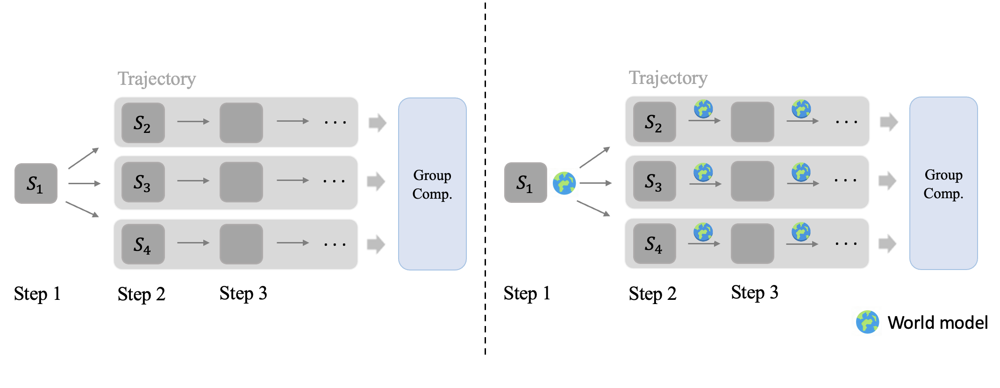
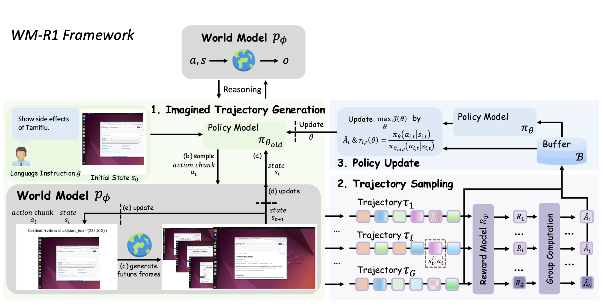
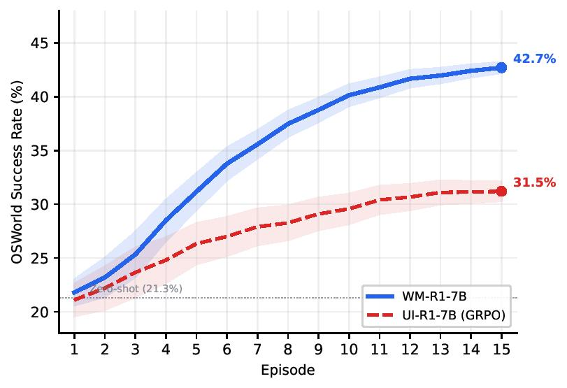

# WM-R1: 通过强化学习训练 GUI 智能体与世界模型协同推理
**[](https://arxiv.org/abs/2606.09961)** · **[中文文档](README_CN.md)**
## 项目简介

WM-R1 是一个强化学习框架，用于训练 GUI 智能体利用 **世界模型（World Model）** 进行推理——用基于 VLM 的模拟器替代昂贵的真实环境交互。

<div align="center">

</div>

传统的 GUI 智能体 RL 训练需要在每一步与真实模拟器或设备进行交互，既慢又消耗资源。WM-R1 使用 [Code2World](https://arxiv.org/abs/2602.09856) ——一个通过生成 **可渲染 HTML 代码** 来预测*下一帧 GUI 截图*的世界模型。智能体可以在这个虚拟沙盒中"想象"其动作的后果，从而实现高效的 model-based RL。

<div align="center">

</div>

## 核心特性

- **世界模型即环境**: Code2World 生成 HTML，通过 Playwright 渲染为 PNG，替代真实 Android 模拟器/桌面环境
- **基于思考的深度推理**: 智能体在 `<think>` 标签内主动调用世界模型，想象动作后果并优化决策
- **DAST 奖励**: 动态退火步数感知轨迹奖励，兼顾任务成功率与轨迹效率，长度预算随训练进程逐步收紧
- **多节点分布式训练**: 基于 Ray 的分布式架构，支持 FSDP 模型并行、vLLM 推理加速、跨节点 NCCL 通信
- **GRPO 基线模式**: 不使用世界模型的标准 GRPO 训练，用于对照实验

## 系统架构

```
┌─────────────────────────────────────────────────────────┐
│                       训练循环                            │
│                                                         │
│  ┌──────────────┐    ┌──────────────┐                   │
│  │   Actor 策略  │◄──►│  vLLM 推理    │  (FSDP + vLLM)   │
│  │ Qwen2.5-VL-3B│    │  (快速生成)   │                   │
│  └──────┬───────┘    └──────────────┘                   │
│         │                                               │
│         ▼                                               │
│  ┌──────────────┐    ┌──────────────┐                   │
│  │  EnvWorker    │───►│   世界模型    │  (每节点 GPU 0)   │
│  │ (每个环境实例) │◄───│  Code2World   │                   │
│  └──────────────┘    │  Qwen3-VL-8B  │                   │
│         │            └──────────────┘                   │
│         ▼                                               │
│  ┌──────────────┐                                       │
│  │ DAST 奖励计算  │  →  GRPO 优势估计  →  PPO 策略更新    │
│  └──────────────┘                                       │
└─────────────────────────────────────────────────────────┘
```

### GPU 分配（每个节点）

| GPU | 角色 |
|-----|------|
| GPU 0 | 世界模型服务（Code2World，HTTP 接口） |
| GPU 1 | 训练（FSDP Actor + vLLM 推理） |

## 工作原理

### 智能体与世界模型的交互

1. 智能体观察当前截图和任务指令
2. 在 `<think>` 标签内，智能体调用世界模型：`call_wm(action='click(start_box=...)')` 预测动作后果
3. Code2World 返回 HTML → 渲染为预测下一状态的 PNG 截图
4. 智能体分析预测结果，可以进行多次想象调用
5. 智能体基于推理结果输出最终的 `Action:`

### DAST 奖励（动态退火步数感知轨迹奖励）

```
R = α · R_成功 + β · R_长度

R_成功 = 1.0（任务完成）或 0.0（未完成）
R_长度 = 根据训练进度和轨迹长度动态计算
```

长度预算从 `max_steps`（宽松，训练初期）向 `avg_len_ref`（紧凑，训练后期）**动态退火**，引导智能体逐步学会更高效的操作轨迹。

## 实验结果

<div align="center">

</div>

OSWorld 上的训练曲线（基于 Qwen2.5-VL-7B）。相比于在真实环境中采用 GRPO 训练的 UI-R1（成功率为 31.5\%），WM-R1 收敛更快，且最终成功率更高（42.7\%）。阴影区域表示基于三个随机种子计算得出的一个标准差范围。

## 支持的环境

| 环境 | 描述 | 状态 |
|------|------|------|
| **AgentNet** | 桌面 GUI 任务（Ubuntu、Windows、macOS） | 主要训练基准 |
| **AndroidWorld** | Android 应用任务 | 通过 Code2World 评估 |
| **OSWorld** | 开放域操作系统任务 | 数据集支持 |

## 快速开始

### 环境准备

```bash
# 需要两个 conda 环境
conda create -n train python=3.10    # 训练（veRL + Ray）
conda create -n wm python=3.10       # 世界模型（Playwright + Qwen3-VL）

# 安装训练依赖
pip install -r requirements.txt

# 安装世界模型依赖（在 wm 环境中）
pip install -r Code2World/requirements.txt
playwright install chromium
```

### 数据准备

```bash
# 准备 AgentNet 数据集
python scripts/data_prepare.py \
    --input agentnet_ubuntu_5k.jsonl agentnet_win_mac_18k.jsonl \
    --output data/ \
    --train_size 9000 --test_size 1000
```

### 训练

```bash
# 提交 Slurm 任务（多节点，每节点 2 GPU）
sbatch examples/run_agentnet.slurm

# 或使用 GRPO 基线（不使用世界模型）
sbatch examples/run_baseline_grpo.slurm
```

### 核心配置

```yaml
# 训练参数
env.use_wm=True                    # 启用世界模型
env.max_steps=15                   # 每个任务的最大交互步数
env.n_wm_max=5                     # 每步最大想象调用次数
data.rollout_batch_size=4          # 每批训练任务数
data.max_trajectory_steps=5        # prompt 中只保留最近 N 步

# 奖励
algorithm.adv_estimator="wm_r1"    # DAST 优势估计
reward.alpha=1.0                   # 成功奖励权重
reward.beta=0.5                    # 长度奖励权重

# 模型
worker.actor.model.model_path=Qwen/Qwen2.5-VL-3B-Instruct
```

## 模型

| 模型 | 角色 | 参数量 | 来源 |
|------|------|--------|------|
| Qwen2.5-VL-3B-Instruct | 智能体策略 | 3B | [Qwen](https://huggingface.co/Qwen/Qwen2.5-VL-3B-Instruct) |
| Code2World | 世界模型 | 8B | [GD-ML/Code2World](https://huggingface.co/GD-ML/Code2World) |

## 项目结构

```
WM-R1/
├── verl/                          # RL 训练框架
│   ├── trainer/
│   │   ├── main.py               # 入口文件
│   │   ├── ray_trainer.py        # 核心训练循环
│   │   ├── gui_agent.py          # 环境交互 + 动作解析
│   │   └── core_algos.py         # PPO/GRPO 算法
│   ├── workers/                   # FSDP 分布式 worker
│   └── utils/reward_score/
│       └── wm_r1.py              # DAST 奖励函数
├── Code2World/                    # 世界模型
│   ├── android_world/agents/
│   │   ├── wm_server.py          # WM 推理 HTTP 服务
│   │   └── wm_utils.py           # 渲染与 API 工具
│   └── ...
├── examples/                      # Slurm 部署脚本
└── scripts/                       # 数据处理工具
```

## 致谢

- **[veRL](https://github.com/volcengine/verl)**: 字节跳动 RL 训练框架
- **[Code2World](https://arxiv.org/abs/2602.09856)**: GUI 状态预测世界模型
- **[Qwen2.5-VL](https://arxiv.org/abs/2502.13923)**: 视觉语言模型
- **[AgentNet](https://arxiv.org/abs/2407.05972)**: GUI 智能体数据集
- **[AndroidWorld](https://github.com/google-research/android_world)**: Android 评估框架
